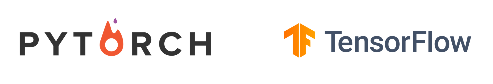

#### Language:
python-3
##### Framwork:
1. Pytorch
2. TensorFlow
   
##### Data Visualization:
1. Tensorboard
2. Matplotlib
3. scipy

#### Image Augmentation:
1. Albumentation

#### CNN Architectures:
1. LeNet
2. AlexNet
3. VGG
4. GoogLeNet
5. ResNet
